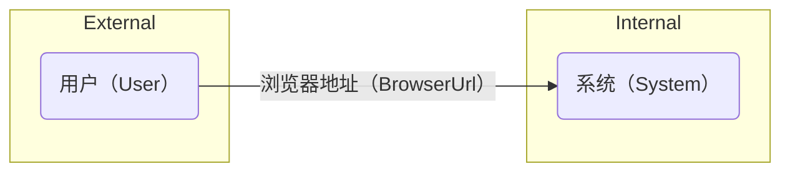

# spec

Specification

## 术语（Terminology）

| 术语（Terminology）   | 定义（Definition） | 字典（Dictionary）                                                                                                                                            | 备注（Comment）                  |
|:------------------|:---------------|:----------------------------------------------------------------------------------------------------------------------------------------------------------|:-----------------------------|
| 用户（User）          | 系统的使用者         | 用户会员等级：；用户管理等级：；用户业务等级：；                                                                                                                                  |                              |
| 系统（System）        | 业务功能可部署的最小单元   | 部署运行依赖软件不同：前端系统（FrontEndSystem）、后端系统（BackEndSystem）；                                                                                                      |                              |
| 浏览器地址（BrowserUrl） | 用户访问某系统功能的标识符号 | http(s)://system[-fe/-be/-fb][-dev/-tst/-uat][-01/-02/-03/...].domain[/system[-fe/-be/-fb][-dev/-tst/-ust][-01/-02/-03/...]][/u][/m][/a][/o][/d]/function | u:usr;m:mgr;a:ai;o:ops;d:dev |

### 访问场景（VisitScenario）

